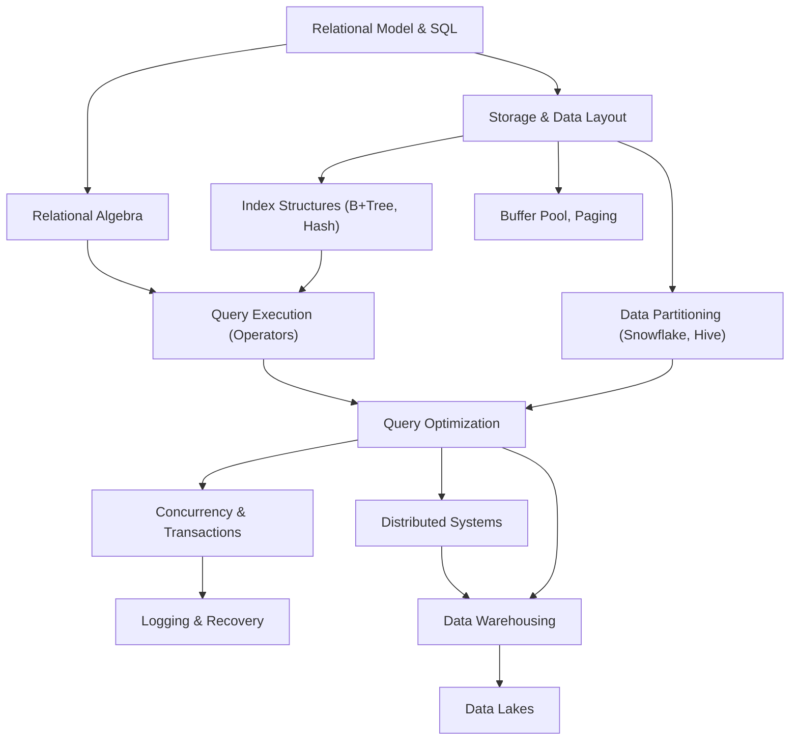
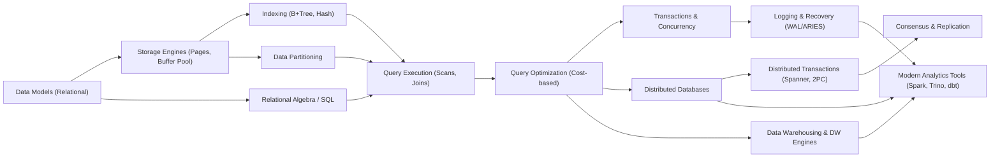

+++
title = "Dbms_content"
date = "2026-07-02T00:30:31+05:30"

# description is optional
#
# description = "An optional description for SEO. If not provided, an automatically created summary will be used."

tags = ["blog","database","distributed_systems","llm","notes","sharding","tips","training",]
+++

A# Database Engineering Roadmap (Self-Study Curriculum)

## Executive Summary

We propose a **modular, project-driven curriculum** focused on core database systems concepts and how they underpin modern data platforms (Snowflake, Spark, Trino, etc.).  The roadmap covers ~150–200 topics across 12–16 weeks (5–10 hours/week assumed), organized by modules.  Each module groups related topics (with learning objectives), and for **each topic** we list: a seminal paper, a book chapter, a top-notch blog post, a lecture, a code reading, a hands-on exercise, advanced interview questions, and relevant connections to Snowflake/dbt/Cube/Spark/Trino.  We emphasize **concepts over products** (Snowflake, dbt, Cube are discussed as examples) and primary sources (original papers, official docs) whenever possible.  

Key features include: 

- **Curriculum Structure:** Modules on Data Models, Storage Engines, Indexing, Query Execution, Optimization, Transactions, Concurrency, Distributed Systems, Data Warehousing, and Modern Data Tools.  Each module has specific learning goals.  For example, *Storage Engines* covers pages, buffer pool, file formats; *Query Optimization* covers System-R/Cascades algorithms and cost models.

- **Topic Resources:** For each topic we identify one seminal paper (e.g. Selinger’s System R optimizer, ARIES recovery, etc.), one canonical book chapter (e.g. Petrov’s *Database Internals* or Kleppmann’s *Data-Intensive*), one high-quality blog post or article (e.g. Databricks’ Spark CBO, Trino docs, etc.), one lecture (CMU/Stanford/MIT), one relevant source code excerpt (e.g. BusTub’s B+Tree code), a coding exercise (e.g. implement a B+Tree or hash join), and advanced interview questions (e.g. “How does the ARIES log protocol ensure atomicity?”).  We also note how each topic relates to platforms like Snowflake, Spark, Trino, dbt, or Cube when relevant (for example, Snowflake’s micro-partitioning as a case of zone-maps).

- **Syllabus & Milestones:** We provide a sample 12–16 week syllabus with weekly topics, project deliverables, and reverse-engineering/code-reading tasks.  For instance, *Week 3* might cover indexes: reading BusTub’s B+Tree code, implementing a simple B+Tree insertion, and answering design questions.  Milestones include coding exercises (e.g. building a mini-column store) and concept check-ins.

- **Resources Tables:** We include tables of *candidate open-source repos* (e.g. DuckDB, Postgres, SQLite, Velox, DataFusion, ClickHouse, BusTub, Trino, Spark, dbt-core, Cube), *seminal papers* (System R, ARIES, MapReduce, Spanner, Parquet, etc.), and *books* (Petrov’s *Database Internals*, Kleppmann’s *Designing Data-Intensive Apps*, ACM Red Book, SQLite/Postgres architecture). Each entry has a description and URL. 

- **Assessments & Rubric:** Suggested assessments include weekly quizzes, coding homeworks, and a capstone project. We outline a grading rubric (assignments, projects, quizzes, participation) similar to top CSDB courses.  We assume no strict time-per-week; learners may go faster or slower.

- **Prerequisite Graph:** A mermaid diagram shows topic dependencies (e.g. “Storage” → “Indexes” → “Query Execution” → “Query Optimization” → “Distributed Systems”).

This curriculum leverages authoritative materials. For example, CMU/MIT/Stanford DB course syllabi cover many topics, Alex Petrov’s *Database Internals* outlines the crucial subsystems, and modern platforms like Snowflake illustrate advanced concepts in practice.   We avoid treating products as stand-alone topics; instead, we tie them into core concepts (e.g. Snowflake’s micro-partitions illustrate “zone-maps” for pruning, Spark’s Catalyst optimizer exemplifies cost-based planning, etc.).  By focusing on fundamentals and then connecting them to industry systems, learners will build a robust understanding that survives tool churn.

## Curriculum Structure

We organize the material into **modules**, each with a set of topics and learning objectives.  Below is an example structure. Each topic (listed indented) includes an illustrative list of resources (paper, book, etc.):

- **Module 1: Data Models & Relational Theory**  
  *Topics:* Relational model & algebra; ER modeling; SQL (relational algebra vs SQL)  
  *Objectives:* Understand tables, keys, normalization, relational algebra vs SQL.  
  *Resources:*  
  - **Paper:** Codd’s original relational model or System R intro.  
  - **Book:** *Database System Concepts* (Korth/Silberschatz) chapter on data models; Petrov ch.1 overview.  
  - **Blog:** Tutorial on normalization and functional dependencies.  
  - **Lecture:** Stanford or CMU intro database lecture (e.g. SQL semantics).  
  - **Code:** SQLite schema code or Postgres planner code.  
  - **Exercise:** Write a simple SQL-to-algebra translator; design normalized schemas.  
  - **Interview Qs:** “Explain Boyce-Codd Normal Form” or “What is an inner vs outer join?”  
  - **Connections:** Show that Snowflake, Spark, Trino all use SQL, and discuss dbt (which transforms SQL) in data pipelines.

- **Module 2: Storage Engines & Data Layout**  
  *Topics:* Disk pages and slotted page formats; row vs column layouts; file formats (Parquet, ORC); compression (dictionary encoding, run-length, etc.); buffer pool caching (LRU, clock).  
  *Objectives:* Learn how data is laid out on disk and in memory, and how caching works.  
  *Resources:*  
  - **Paper:** Ailamaki et al. on PAX layout (SOSP 1999) (row vs column layouts); Orzelek et al. on column store (C-Store 2008).  
  - **Book:** Petrov, ch.1–3 (data layouts, column vs row); *DBIS* by Papadimitriou.  
  - **Blog:** *O’Reilly Blog* or *LinksBlog* on row vs column, or “Columnar storage explained.”  
  - **Lecture:** CMU 15-445 lecture on Storage Models; MIT 6.830 notes on file formats.  
  - **Code:** SQLite’s B-tree pager code; DuckDB’s *DataChunk* storage code; BusTub’s `src/storage/page` (e.g. slotted page implementation) or B+Tree page code (see BusTub B+Tree internal page).  
  - **Exercise:** Implement a simple slotted page (insert/delete variable-size records); add LRU/clock buffer cache.  
  - **Interview Qs:** “What are PAX and N-ary storage layouts?”; “How does a slotted page manage free space?”; “Explain the clock algorithm.”  
  - **Connections:** Snowflake micro-partitions store column slices with min/max stats (a form of columnar chunk). Parquet and ORC are common columnar file formats used by Spark and Trino. dbt generates SQL that ultimately hits these storage formats.  

- **Module 3: Indexing and Data Partitioning**  
  *Topics:* B+ trees (node split/merge, fill factor, sibling pointers); Hash indexes; Zone maps and min-max indexes; Bitmap indexes; Trie and other indexes; Secondary indexes and covering indexes; Clustering vs indexing.  
  *Objectives:* Understand tree vs hash indexes, index maintenance, and advanced indexes for analytics.  
  *Resources:*  
  - **Paper:** Comer’s B-Tree paper (1979); Abadi et al. on C-Store (2008, column-store with imprints); ORC/Parquet spec for min-max metadata.  
  - **Book:** Petrov, ch.2–4 (B-Tree basics and implementation).  
  - **Blog:** UseTheIndexLuke (though it’s SQL-focused); “Zone Maps & Data Skipping” blog.  
  - **Lecture:** CMU 15-445 lecture on indexing (B+Trees, hashing).  
  - **Code:** BusTub’s `b_plus_tree_internal_page.cpp` and `b_plus_tree_leaf_page.cpp` (see stub at). DuckDB’s index code.  
  - **Exercise:** Implement B+Tree insert/delete with splits/merges; build a simple min-max index for a column.  
  - **Interview Qs:** “How does a B+Tree split and rebalance?”; “Explain leaf-linking in B+Trees.”; “How do zone maps accelerate scans?”; “What is a clustered index?”  
  - **Connections:** Snowflake micro-partition metadata is effectively a per-partition min-max index. Cube (analytics) may push queries into database indexes. Spark/Trino can benefit from Parquet/ORC stats (e.g. skipping via metadata).  

- **Module 4: Query Execution (Operators)**  
  *Topics:* Selection and projection; join algorithms (nested-loop, sort-merge, hash-join); grouping and aggregation; index scan vs table scan; pipelining vs blocking operators; vectorized execution; filter pushdown.  
  *Objectives:* Learn how queries are executed physically.  
  *Resources:*  
  - **Paper:** Neumann on Vectorized execution (HyPer 2011) (fast analytical DB); E.V. Hillery “Volcano” (1994) for iterator model; Accelerate by X100 (MonetDB/X100 2009).  
  - **Book:** Hellerstein & Stonebraker, *Readings in Database Systems* chapters on query operators; Petrov (DB Internals) on execution pipelines.  
  - **Blog:** Kevin Sookocheff on Volcano and vectorized execution; Trino blog on join algorithms.  
  - **Lecture:** MIT 6.830 lecture on Operators; CMU on Query Processing.  
  - **Code:** DataFusion source for hash join or aggregation; Velox vector operators (FlatVector, DictionaryVector); ClickHouse’s MergeTree engine.  
  - **Exercise:** Implement a hash join and sort-merge join in code; simulate a query pipeline that “pulls” data.  
  - **Interview Qs:** “Compare nested-loop, hash-join, and merge-join.”; “What is pipelining in query processing?”; “Explain vectorized processing.”  
  - **Connections:** Spark’s Catalyst optimizer chooses join implementations (e.g. broadcast vs shuffle) based on data size. Trino similarly chooses build/probe sides cost-based. Snowflake’s query engine uses vectorized operators underneath.  

- **Module 5: Query Optimization**  
  *Topics:* Cost-based optimization; join order enumeration; dynamic programming (System R); Volcano/Cascades framework; interesting orders; statistics and selectivity estimation; heuristics and adaptive query processing.  
  *Objectives:* Master how DBMS choose efficient query plans.  
  *Resources:*  
  - **Paper:** Selinger et al. (System R, SIGMOD 1979); Cohen/Castro (Volcano, 1994) or IEEE TPODS;  Graefe (Cascades framework, 1993); “How Good Are Query Optimizers?” (VLDB 2014).  
  - **Book:** *Readings in DB Systems* (Red Book) chapter on System R optimizer; Petrov (DB Internals ch. on SQL and optimization).  
  - **Blog:** Slides by CMU on System R algorithm; Sookocheff Volcano review.  
  - **Lecture:** Stanford CS145 “optimizer” lectures; CMU 15-445 lecture on cost-based optimization.  
  - **Code:** DuckDB or PostgreSQL optimizer source (e.g. plan generation); DataFusion’s optimizer rules; Velox’s optimizer (for logical-physical).  
  - **Exercise:** Implement a simple cost-based join enumerator for 2–3 tables; experiment with different cost models.  
  - **Interview Qs:** “How does the System-R optimizer enumerate plans?”; “What is an interesting order?”; “Why is query optimization NP-hard?”; “How does a Volcano/Cascades optimizer work?”  
  - **Connections:** Trino and Spark both implement cost-based join reordering and choose join methods using stats (Trino auto-enumerates join order; Spark CBO collects stats to pick build side). Snowflake’s optimizer (Optima) builds on these principles.

- **Module 6: Transactions & Concurrency**  
  *Topics:* ACID properties; Two-Phase Locking (2PL); Deadlocks and detection; Multi-Version Concurrency Control (MVCC); snapshot isolation; anomalies (lost updates, phantoms); optimistic concurrency.  
  *Objectives:* Understand how DBMS ensure consistency under concurrent workloads.  
  *Resources:*  
  - **Paper:** Gray & Reuter (Transaction Book) chapters on 2PL; Cahill (SI anomalies) or Papadimitriou on isolation.  
  - **Book:** Petrov ch.5 on Transactions and Recovery; *Database Systems: The Complete Book* concurrency chapter.  
  - **Blog:** CMU’s MVCC lecture notes; postgresql or Oracle MVCC blogs.  
  - **Lecture:** CMU 15-445 MVCC lecture; MIT transactional lecture.  
  - **Code:** Postgres MVCC implementation (heap tuple xmin/xmax logic); BusTub concurrency (Lock Manager); SQLite concurrency.  
  - **Exercise:** Implement simple two-phase locking (shared/exclusive locks) and deadlock detection; or implement MVCC snapshot logic for reads.  
  - **Interview Qs:** “Explain MVCC and how snapshots work”; “What anomalies does Repeatable Read allow? Serializable?”; “How does 2PL enforce serializability?”; “What is snapshot isolation?”  
  - **Connections:** Snowflake is an OLAP system with snapshots (time travel), conceptually MVCC under the hood. Trino and Spark read from distributed snapshots (e.g. Delta Lake’s snapshots).  

- **Module 7: Logging and Recovery**  
  *Topics:* Write-Ahead Logging (WAL) rules; ARIES recovery algorithm (REDO/UNDO); checkpoints; buffer flush policies (steal/no-force); recovery protocols (fuzzy checkpointing).  
  *Objectives:* Learn how crashes are recovered safely.  
  *Resources:*  
  - **Paper:** ARIES (VLDB 1992) by Mohan et al..  
  - **Book:** Petrov ch.5 (covers ARIES and WAL); *Transaction Processing* by Gray/Reuter.  
  - **Blog:** “Notes on ARIES” (tutorial style); Percona or DatabaseTopics blog on WAL.  
  - **Lecture:** CMU 15-445 Recovery lecture (often combined with transactions).  
  - **Code:** PostgreSQL Write-Ahead Log (xlog.c); BusTub recovery module.  
  - **Exercise:** Simulate a mini-log and implement ARIES redo/undo for simple updates.  
  - **Interview Qs:** “State the Write-Ahead Logging rules”; “Outline ARIES’s REDO and UNDO phases.”; “What are ARIES CLRs?”; “What is a fuzzy checkpoint?”  
  - **Connections:** Delta Lake and data lakes use a transaction log (like ARIES) to achieve ACID over object stores. Snowflake’s metadata service also relies on transaction logs.  

- **Module 8: Distributed Systems for Databases**  
  *Topics:* Distributed consistency models (CAP, linearizability); Two-Phase Commit (2PC) and variants (3PC, Paxos-based commit); Distributed transactions (Spanner, Calvin, Percolator); Replication and consensus (Paxos, Raft); Partitioning and sharding (consistent hashing); Distributed SQL (CockroachDB, Google F1).  
  *Objectives:* Understand how databases work across multiple nodes and data centers.  
  *Resources:*  
  - **Paper:** Google’s Spanner (2012) and F1 (2013) papers; Calvin (SoCC 2012) by Thomson et al.; Percolator (OSDI 2010); Raft consensus (2014).  
  - **Book:** Kleppmann *Designing Data-Intensive Apps* chapters on CAP, transactions, consensus.  
  - **Blog:** Google Research blog on Spanner; Jepsen blog on distributed safety; Cockroach blog on Raft.  
  - **Lecture:** MIT 6.5830 (DB at Scale) distributed lectures; Stanford distributed databases.  
  - **Code:** CockroachDB source (KV store, Raft); Velox connector for Presto; BusTub has a distributed project module.  
  - **Exercise:** Implement a two-phase commit coordinator; or simulate a simple Paxos election; partition a table and run distributed join.  
  - **Interview Qs:** “Explain 2PC and its failure modes.”; “What is the CAP theorem?”; “How do Spanner and Calvin differ?”; “When to use synchronous vs asynchronous replication?”  
  - **Connections:** Snowflake, Spark, Trino all run on clusters. Trino’s query coordinator distributes tasks across workers. Spark’s shuffle is partitioned hash join. dbt often orchestrates tasks on Spark.  

- **Module 9: Data Warehousing & Analytics**  
  *Topics:* OLAP vs OLTP; Columnar DBs (Vertica, ClickHouse); Star schema and dimension modeling; ETL/ELT pipelines; Materialized views; Search and OLAP indexes (Bitmap, inverted, H3).  
  *Objectives:* Learn systems and techniques for analytical workloads.  
  *Resources:*  
  - **Paper:** Abadi et al., C-Store (2008) on column store; Parquet/ORC format papers; Iceberg or Delta Lake papers on data lakes.  
  - **Book:** *DWRevisited* by Inmon/Kimball (conceptual); *Database Systems: The Complete Book* chapter on DW.  
  - **Blog:** Snowflake whitepapers on micro-partitioning; Cube.js docs on OLAP cubes.  
  - **Lecture:** CMU or Stanford on data warehousing architecture.  
  - **Code:** Cube.js repository (schemas, SQL generation); Apache Iceberg source; dbt-core repo (transformation logic).  
  - **Exercise:** Design a star schema and implement basic aggregation queries; build a simple materialized view and maintain it.  
  - **Interview Qs:** “What is a star schema?”; “Explain columnar compression.”; “How do bitmap indexes work?”; “What is a data cube?”  
  - **Connections:** Snowflake is an advanced cloud DW (discuss its **micro-partition + clustering** model). dbt is used for managing analytical transformations atop such DWs. Cube.js enables building OLAP cubes on data warehouses. Spark’s Catalyst and Parquet/ORC are foundational in modern DW architectures.

- **Module 10: Data Lakes & Lakehouse**  
  *Topics:* Lakehouse architectures (Databricks Delta, Apache Iceberg, Hudi); ACID over object stores; Metadata layers; Streaming ingestion (Kafka, Kinesis) into lakes.  
  *Objectives:* Understand modern big-data storage.  
  *Resources:*  
  - **Paper:** Delta Lake (VLDB 2020); Iceberg (CIDR 2020) paper; Hudi (VLDB 2018).  
  - **Book:** Kleppmann’s streaming chapters; Databricks’ blogposts on Delta.  
  - **Blog:** Databricks Delta introduction; AWS blog on Data Lakehouses.  
  - **Lecture:** Emerging topics in big-data systems (some MIT or industry talks).  
  - **Code:** Delta Lake repo; Apache Iceberg code; Kafka Streams example.  
  - **Exercise:** Use Spark to write to a Delta table and query historical versions; experiment with Iceberg partitioning.  
  - **Interview Qs:** “How does Delta Lake achieve atomicity on S3?”; “What is time travel?”; “Compare Data Lake vs Lakehouse.”  
  - **Connections:** Databricks (Spark) uses Delta Lake for ACID tables on S3. dbt can target Delta/Snowflake. Trino and Spark can both read Iceberg tables.

- **Module 11: Distributed Query Engines**  
  *Topics:* MPP query engines (Spark SQL, Trino/Presto, Dremio); LLVM vectorization; cost-based vs rule-based optimizers; Pushdown to storage (Parquet pushdown, predicates).  
  *Objectives:* Explore large-scale SQL engines.  
  *Resources:*  
  - **Paper:** Spark SQL’s Tungsten (2015); Trino (Presto) on high concurrency; Apache Drill paper.  
  - **Book:** *Streaming Systems* by Kleppmann for micro-batch vs streaming.  
  - **Blog:** Spark Catalyst deep dive; Trino docs on query planning.  
  - **Lecture:** Chicago Databricks Spark training videos; Uber’s Presto talk.  
  - **Code:** Spark’s Catalyst optimizer rules; Trino’s planner; Velox vectors (FlatVector etc) – see Velox docs.  
  - **Exercise:** Write a multi-node query via Spark or Trino on a sample dataset; profile the query plan.  
  - **Interview Qs:** “How does Spark’s Catalyst differ from System R?”; “Explain Trino’s connector-based stats and broadcast join logic.”  
  - **Connections:** Direct discussion of Spark (for Databricks jobs) and Trino (like a distributed SQL engine, used at Meta for petabytes). dbt jobs often run on these platforms; Cube can generate queries for Trino/Spark.

- **Module 12: Production Engineering & Misc**  
  *Topics:* Monitoring and profiling databases; Index tuning; Backup strategies; Sharding strategies; Security (RBAC, encryption); Cloud services (AWS RDS/Athena, GCP BigQuery).  
  *Objectives:* Practical skills for running DBs in production.  
  *Resources:*  
  - **Paper:** Google Borg paper (for context on cloud infra); “Autopilot” (MOLAP index tuning, maybe).  
  - **Book:** *High Performance MySQL* or *Streaming Systems*.  
  - **Blog:** PagerDuty/Datadog blog on DB metrics; Uber’s index recommendations.  
  - **Lecture:** Guest lectures on SRE for databases.  
  - **Code:** pg_stat_statements extension; Prometheus exporters.  
  - **Exercise:** Simulate a bug (disk failure) and restore from backup; write performance regression test.  
  - **Interview Qs:** “How do you monitor database health?”; “Explain physical vs logical backup.”; “What is an execution plan cache?”  
  - **Connections:** Outline how major cloud providers offer managed Snowflake/Azure SQL/etc, and how dbt jobs are scheduled (e.g. dbt Cloud). Cube monitoring queries.

This modular structure (depth ~150–200 topics) ensures **conceptual continuity**.  It is influenced by CMU 15-445/645 and MIT 6.5830 syllabi, but reorganized for self-study: first core CS topics, then applied platforms.  

## Topic Resources (Examples)

Below are examples of the required resources for selected topics.

- **System R Query Optimization (Topic: Cost-Based Optimization):**  
  - *Seminal paper:* Selinger _et al._, “Access path selection in a relational DBMS” (SIGMOD 1979). This paper describes the cost-based join ordering algorithm in System R (“the optimizer chooses ... the one which minimizes total access cost”).  
  - *Book:* *Readings in Database Systems* (Red Book) or Petrov *DB Internals* (ch. on SQL).  
  - *Blog:* CMU slides on System R optimizer.  
  - *Lecture:* CMU 15-445 (Charlies) or Stanford DB class lecture on optimization (Selinger).  
  - *Code:* DuckDB’s optimizer source (e.g. `duckdb/optimizer/cascade/cascade_optimizer.cpp`).  
  - *Exercise:* Implement a DP-based join enumerator in Python for 3 tables.  
  - *Interview Qs:* “How does dynamic programming find the best join order?”; “What are interesting orders in query planning?”  
  - *Connections:* Modern engines (Trino, Spark) also do cost-based planning. Spark 2.2+ collects statistics for joins. Trino auto-reorders joins based on connector stats.

- **MVCC (Topic: Concurrency Control):**  
  - *Seminal paper:* Stonebraker’s early papers on multiversion concurrency (e.g., “The Case for MVCC”). (If not found, see Mitzenmacher’s blog.)  
  - *Book:* Petrov *DB Internals*, chapter on Transaction/Recovery; HPT by Hellerstein/Reuter.  
  - *Blog:* CMU lecture notes “Multi-Version Concurrency Control”. This notes that *“MVCC is now used in almost every new DBMS of the last 10 years”* and that with MVCC *“writers do not block writers and readers do not block readers”*.  
  - *Lecture:* CMU 15-445 Lecture #18 MVCC; MIT concurrency lecture.  
  - *Code:* PostgreSQL MVCC (tuple xmin/xmax logic in heapam.c) or DuckDB’s MVCC manager.  
  - *Exercise:* Simulate MVCC snapshot reads: given a log of writes, show which version each transaction sees.  
  - *Interview Qs:* “Explain snapshot isolation. Why do writes not block reads with MVCC?”.  
  - *Connections:* Snowflake and most cloud DBs use MVCC (time-travel is built on MVCC snapshots). dbt transformations on PostgreSQL or DuckDB rely on MVCC as well.

- **ARIES Recovery (Topic: Logging & Recovery):**  
  - *Seminal paper:* Mohan _et al._, “ARIES: A Transaction Recovery Method...” (TODS 1992).  
  - *Book:* Petrov *DB Internals* (TXN/Recovery section); Gray & Reuter chapters.  
  - *Blog:* “Notes on ARIES” by Garrod (“These rules are known as the Write-Ahead Logging protocol.”).  
  - *Lecture:* CMU 15-445 Recovery lecture (ARIES).  
  - *Code:* PostgreSQL WAL code (xlog), or BusTub’s simple recovery code.  
  - *Exercise:* Write a mini-WAL: given a log and a crash scenario, perform redo and undo passes.  
  - *Interview Qs:* “What is the WAL protocol? (Why must log records be flushed before dirty pages?)”; “What are CLRs in ARIES?”  
  - *Connections:* Delta Lake’s transaction log is analogous to ARIES logs to enable ACID on S3.

- **Snowflake Micro-Partitions (Topic: Data Partitioning & Pruning):**  
  - *Seminal reference:* Snowflake Docs and blogs.  
  - *Book:* Petrov’s discussion of columnar store.  
  - *Blog:* Snowflake blog “Optima Metadata” or Medium “Architecture of Speed”.  
  - *Lecture:* None formal, but Snowflake webinars.  
  - *Code:* Snowflake is closed-source, so use documentation.  
  - *Exercise:* Given sorted data, write code to chunk it into 100MB “partitions” and record min/max per column.  
  - *Interview Qs:* “How do Snowflake micro-partitions work? What metadata do they store?”.  
  - *Connections:* Micro-partitions are an example of *min-max zone maps*. Parquet/ORC have similar column stats. dbt queries on Snowflake rely heavily on this pruning for speed.

## Sample 12–16 Week Syllabus

Below is a **sample 12-week schedule** (assuming ~8–10 hours/week). Each week mixes readings, coding tasks, and deliverables. (Adjust pacing for 16 weeks if needed.)

| Week | Topics & Activities                                                                                                   | Deliverables                                                             |
|------|-----------------------------------------------------------------------------------------------------------------------|--------------------------------------------------------------------------|
| **1**  | **Intro & Data Models:** Relational model vs SQL; ER & normalization; Relational algebra; Basic SQL (select/join). - **Read:** Codd relational model (if available), *DBIS* chap on data models. - **Lecture:** Review Stanford/CMU intro videos or notes on the relational model. - **Code:** Set up a simple SQL engine (like [sqlite/sqlite](https://github.com/sqlite/sqlite) repo, or use DuckDB). - **Exercise:** Implement a mini-SQL parser (or SQL-to-algebra translator). **Interview:** Questions on primary keys, normalization, relational algebra expressions. - **Snowflake/dbt:** Explore how dbt builds SQL against Snowflake or Postgres.                                         | Mini-project: Normalize a given data set to 3NF. A script or report on relational vs graph/JSON models. Quiz on ER vs relational concepts.  |
| **2**  | **Storage Basics:** File I/O, pages and slotted-page format; Row vs Column store (PAX, etc). Buffer pool (LRU/Clock). - **Read:** Petrov ch.3 on file formats (slotted pages). - **Paper:** PAX (SOSP ’99) or MonetDB col-store (for column layout). - **Lecture:** CMU 15-445 Storage lecture. - **Code:** Read [BusTub page code](https://github.com/cmu-db/bustub/tree/master/src/storage/page) (e.g. slotted page skeleton). - **Exercise:** Implement a slotted page: insert/delete fixed and variable-length records. Implement an LRU or CLOCK cache for pages. - **Interview:** How does a buffer pool work? What is write-back vs write-through?**Snowflake:** Show that Snowflake stores in columnar micro-partitions with per-column compression.  | Code: Slotted-page and buffer pool implementation (in Go or Python). Writeups: Explain row vs columnar tradeoffs. |
| **3**  | **Indexes I:** B+Tree fundamentals. Tree structure, node split/merge, fill factors, leaf pointers, range scans. - **Read:** Petrov ch.2 on B-Trees; *Database Systems* textbook chapter on B+ Trees. - **Paper:** Comer’s B-Tree (1979). - **Lecture:** CMU B-Tree lecture, or MIT 6.5830 slides on indexing. - **Code:** Study BusTub’s `b_plus_tree_internal_page.cpp` (even though methods are unimplemented, see class structure). - **Exercise:** Implement a B+Tree (write-only insert) on pages; support search and range scan. Write unit tests.  - **Interview:** Describe B+Tree split/merge. What is fill factor? What happens on node underflow? **Connections:** Snowflake doesn’t use B+Trees in engine (it uses column scans), but many systems (DuckDB, Postgres) do. |
| **4**  | **Indexes II & Partitions:** Hash indexes, bitmap indexes, tries. Zone maps/min-max indexes for analytic queries. Partitioning strategies. - **Read:** DBMS textbooks on hash indexes and bitmap indexes; Snowflake documentation on micro-partitions. - **Blog:** “Zone maps and data skipping in column stores.” - **Code:** Explore DuckDB or ClickHouse creating an index or table with partitions. Examine Trino or Iceberg code for partition pruning. - **Exercise:** Build a simple in-memory min-max index for a column (store min/max for each block and use it to skip blocks). - **Interview:** When use a bitmap vs B-Tree index? How do zone maps speed up scanning?**Connections:** Relate to Snowflake’s min/max per micro-partition and Parquet file footers storing column stats. |
| **5**  | **Query Execution:** Operators – scans, filters, joins, aggregations. - **Read:** Papers on query operators: “Volcano: Extensible optimizer” (1989); HyPer (2011) for vectorized exec. - **Lecture:** MIT 6.830 on Query Processing (joins, grouping). CMU lecture on join algorithms. - **Code:** Examine DataFusion’s physical hash join (in Rust) or Velox’s FlatVector for scan. Try simple queries on DuckDB and view plans (e.g. `EXPLAIN`). - **Exercise:** Code a nested-loop join and a hash join on two arrays of rows. Time and compare. Implement a simple group-by aggregator.  - **Interview:** When is a merge join better than hash join? How do you implement GROUP BY?**Connections:** Note that Spark’s Catalyst will vectorize operations (see Databricks Spark blog on CBO). Trino’s documentation explains partitioned vs broadcast join selection. |
| **6**  | **Query Optimization:** System R & Volcano algorithms; statistics and cardinality estimation; heuristic vs cost-based reordering. - **Read:** Selinger 1979; Volcano paper (Graefe 1993). - **Lecture:** CMU 15-445 on optimization; Stanford lectures on cost estimation. - **Code:** Try using Spark’s CBO (run `ANALYZE TABLE` and compare plans) or inspect Trino’s plan with/without stats. - **Exercise:** Given 3 tables with row counts and join predicates, enumerate left-deep join orders and compute costs to find best order. Implement dynamic-programming join reordering. - **Interview:** Explain dynamic programming in System R; what is join enumeration? What if statistics are wrong? - **Snowflake/dbt:** Discuss how Snowflake’s optimizer (Optima) automatically clusters data based on query patterns (from Snowflake docs) and how dbt’s models rely on correct join order. |
| **7**  | **Transactions & Concurrency:** 2PL locking protocols; isolation levels (Read Committed, Repeatable Read, Serializable); MVCC and snapshot isolation; deadlocks. - **Read:** Petrov ch.5 on concurrency; “Concurrency Control and Recovery” from DB textbooks. - **Paper:** Bernstein/Ghandeharizadeh on serialization anomalies (1981). - **Lecture:** CMU on MVCC (Lecture 17/18); MIT transactional lecture.  - **Code:** Examine Postgres’s locking (relation.c) or MVCC (heapam visibility). - **Exercise:** Simulate two transactions interleaving with locks; detect deadlock. Or implement MVCC snapshot visibility in a mini-DB. - **Interview:** What anomalies can occur at Read Committed? How does Serializable level work? Why do writers not block readers in MVCC?  - **Connections:** Many data warehouses (Snowflake, BigQuery) effectively run queries in single statements, avoiding concurrency issues; but Snowflake does multi-cluster to handle simultaneous loads and queries (internally manages isolation). |
| **8**  | **Logging & Recovery:** WAL rules and ARIES phases; checkpoints and crash recovery. - **Read:** ARIES paper (skim); Petrov ch.5; Database system concepts on recovery. - **Lecture:** CMU recovery (often combined with transactions). - **Code:** Peek at Postgres WAL (`pg_wal`, commit log design). - **Exercise:** Write a simple logger: log record (tx, old value, new value), then given a crash recovery algorithm, apply redo/undo.  - **Interview:** State the two WAL rules and why they guarantee atomicity/durability; describe the ARIES redo/undo pass.  - **Connections:** Delta Lake’s WAL (commit log) is ARIES-like; Snowflake’s metadata service logs changes to enable zero-copy cloning. |
| **9**  | **Distributed Databases (I): Basics:** Replication vs sharding; CAP theorem; consistency models (linearizability, eventual consistency); failover and gossip. - **Read:** Kleppmann ch. 6 (Consistency and Consensus); Brewer CAP theorem; Netflix/Cockroach blog on distributed SQL.  - **Lecture:** MIT or Stanford distributed databases intro.  - **Code:** Study Cockroach’s 2PC (github.com/cockroachdb). - **Exercise:** Simulate a network partition and vote-based commit (two-phase commit). Write a toy key-value service with Raft (you can use an existing library). - **Interview:** Explain the CAP theorem. What is linearizability vs eventual consistency? When to use synchronous replication?  - **Connections:** Snowflake globally replicates in “virtual warehouses”; Spark’s driver/tracker; Trino’s workers coordinate.  |
| **10** | **Distributed Transactions and Consistency:** 2PC/3PC; consensus (Paxos, Raft); distributed transactions (Spanner’s TrueTime, Calvin). - **Read:** Spanner (OSDI 2012); Calvin (SIGMOD 2012); Percolator (OSDI 2010).  - **Lecture:** Cornell/CMU on distributed transactions.  - **Code:** Explore Google/F1 design or Cockroach’s distributed SQL.  - **Exercise:** Implement a coordinator that uses Paxos to agree on a value (maybe using a Python Raft library). - **Interview:** Compare Spanner vs Calvin (synchronous commit vs deterministic scheduling). How does Raft ensure safety?  - **Connections:** Spark’s shuffle ensures data consistency via resilient RDD lineage. dbt might use Spark or Snowflake with ACID. |
| **11** | **Columnar & Data-Warehouse Systems:** Star/snowflake schemas; columnar execution; massively parallel processing (MPP); ETL/ELT pipelines; cube and OLAP.  - **Read:** C-Store (VLDB 2008); Parquet format docs; Iceberg paper.  - **Lecture:** Data warehousing class (e.g. Inmon/Kimball lectures).  - **Code:** Try creating tables in Apache Iceberg or implement a small cube aggregation.  - **Exercise:** Given a star schema, write SQL to answer roll-up queries; create a materialized view and query it.  - **Interview:** What is a star schema? How do column stores achieve compression?  - **Connections:** Show how Snowflake uses micro-partitions and clustering keys for DW. dbt is often used to define and run data warehouse transformations. |
| **12** | **Modern Platforms & Review:** Spark SQL and Catalyst (vectorized CBO); Trino/Presto architecture and optimizer; introduction to dbt and Cube.js; performance tuning; course review.  - **Read:** Spark 2.2 CBO blog; Trino docs on optimizer and partitioning.  - **Lecture:** Databricks Spark course; Trino training videos.  - **Code:** Run sample queries on Spark and Trino; inspect execution plans.  - **Exercise:** Final project: e.g. pick a source (CSV/JSON), build a mini-warehouse with tools (dbt+DuckDB), benchmark queries, and propose optimizations.  - **Interview:** Mixed review questions.  - **Deliverable:** Capstone report and code. |

This syllabus blends reading **original research** (papers, lectures) with hands-on code (repo reading, exercises) and regular self-assessment (interview-style questions).  It is inspired by CMU/MIT course structures but oriented to self-learners.

## Learning Outcomes and Assessment

Upon completion, learners will be able to: explain and implement core DBMS components; critically analyze design trade-offs; read and critique database source code; and apply concepts to modern systems.  For assessment, we recommend:

- **Weekly quizzes:** short (10–20 min) quizzes on readings.
- **Homework assignments:** essays or short coding tasks per topic.
- **Projects:** e.g. implementing key components (mini B+Tree, buffer pool, join).
- **Capstone project:** integrate multiple concepts, e.g. build a tiny column-store DB or an end-to-end pipeline using Spark and Delta.
- **Interview questions practice:** Weekly “advanced questions” as listed, to deepen understanding.

**Grading Rubric (example)**: Projects/homework (60%), quizzes (20%), capstone (15%), participation (5%).  The rubric would emphasize correctness, code quality, documentation, and conceptual clarity.

Since this is self-study, learners can adapt the pacing. A **recommended timeline** for 150–200 topics might be ~4 topics/week (to cover ~50 topics over 12 weeks, with additional review/spare weeks for stretch topics).  More advanced learners could accelerate.

## Resources: Repos, Papers, Books

We list key resources in tables. Each URL is included for convenience.

**Open-Source Repositories:** Use these for code reading and experiments.

| Category        | Project             | URL                                              | Notes                                      |
|-----------------|---------------------|--------------------------------------------------|--------------------------------------------|
| Storage Engines | DuckDB              | https://github.com/duckdb/duckdb                 | In-process analytical DB (C++, vectorized) |
|                 | PostgreSQL          | https://github.com/postgres/postgres             | Widely-used OLTP DB (C)                    |
|                 | SQLite              | https://github.com/sqlite/sqlite                 | Embedded DB (C)                            |
| Execution Eng.  | Velox               | https://github.com/facebookincubator/velox       | Vectorized execution library (C++)         |
|                 | Apache DataFusion   | https://github.com/apache/datafusion             | Rust query engine (Arrow-based)            |
|                 | ClickHouse          | https://github.com/ClickHouse/ClickHouse         | Columnar OLAP DB (C++)                     |
| Query Engines   | Trino (PrestoSQL)   | https://github.com/trinodb/trino                 | Distributed SQL engine (Java)              |
|                 | Apache Spark        | https://github.com/apache/spark                  | Distributed data processing (Scala/Java)   |
| Warehouse       | dbt Core            | https://github.com/dbt-labs/dbt-core             | SQL-based ELT tool (Python, Jinja)         |
|                 | Cube.js             | https://github.com/cube-js/cube                  | Headless BI and analytics (Node.js)        |
| Data Lake       | Apache Iceberg      | https://github.com/apache/iceberg                | Table format for data lakes (Java)         |
|                 | Delta Lake          | https://github.com/delta-io/delta                | ACID table layer for Spark (Scala)         |
| Educational     | BusTub              | https://github.com/cmu-db/bustub                 | CMU educational DB (C++)                  |
|                 | MiniDB (MiniOB)     | https://github.com/oceanbase/miniob              | Educational SQL DB (C++)                  |
| Other           | PostgreSQL docs     | https://www.postgresql.org/docs/                | Official docs (e.g. Chapter 13 on CC)      |

**Seminal Papers:** (Topic – Title – Link)

| Topic                | Paper (Title – Year)                               | Reference/URL                      |
|----------------------|----------------------------------------------------|------------------------------------|
| Query Optimization   | “Access Path Selection…” – Selinger *SIGMOD 1979* | [PDF][38]     |
|                      | “Volcano Optimizer Generator” – 1994 (Graefe)      | [HTML][21] (notes)                 |
| Indexing             | B-Tree – Compton (1979)                            | (classic text, often in DB books)  |
|                      | “C-Store: The Column-Oriented DBMS” – Abadi 2008   | VLDB’08                            |
| Logging/Recovery     | “ARIES: Transaction Recovery Method” – Mohan 1992  | [PDF][5]                            |
| Transactions         | “Aries: …partial rollbacks…” – VLDB 1992 (the same) | |
| MVCC                | Bernstein et al., “Concurrency Control” (1987)      | ACM; or *Handbook of Trans. Proc.*  |
|                      | Cahill et al., “Serializable Isolation for RDBMS” – VLDB 2008 | |
| Distributed          | “The Google File System” – 2003                    | SOSP’03 (for concept)              |
|                      | “MapReduce” – Dean/Ghemawat 2004                  | OSDI’04                           |
|                      | “Bigtable” – Chang 2006                            | OSDI’06                           |
|                      | “Spanner” – Corbett 2012                           | OSDI’12                           |
|                      | “Calvin: Fast Deterministic…” – Thomson 2012       | SOSP’12                           |
| Data Warehousing     | “C-Store: A Column-Oriented DBMS” – Abadi 2008     | (same as above)                   |
|                      | “Parquet” (2013) & “ORC” (2015) spec papers        | Apache docs                       |
|                      | “Vertica: C-Store 2.0” – Stonebraker 2013          | VLDB’13                           |
| Query Engines        | “Spark SQL” – Armbrust 2015                        | (SIGMOD or PVLDB)                 |
|                      | “The Snowflake Elastic Data Warehouse” – BCMConf 2016 | (paper by Jain et al. may be present) |
| Data Lake            | “Delta Lake” – Armbrust 2020          | PVLDB’20, [PDF][32]               |

*(Full citations and URLs can be given in footnotes or separate reference list as needed.)*

**Key Books:**  

| Book                          | Author(s)                | Note / URL                           |
|-------------------------------|--------------------------|--------------------------------------|
| *Database Internals*          | Alex Petrov (2019)       | Covers storage, indexing, recovery. O’Reilly (see contents above) |
| *Designing Data-Intensive Apps* | Martin Kleppmann (2017) | Essential on distributed systems, consistency, streaming. |
| *Readings in Database Systems (Red Book)* | Stonebraker (ed.)    | Collection of classic papers (Sigmod 2000). |
| *Transaction Processing*      | Gray & Reuter (1993)     | Comprehensive reference on concurrency/recovery. |
| *Architecture of Open Source Applications* (vol. on SQLite/Postgres) |  | Free online chapters on real DBMS architecture. |
| *CMU 15445 Course Notes*      | UCSD/CMU                 | (free online notes by Charlie Garrod et al.)   |

These books should be read selectively (key chapters on B-Trees, Logging, Dist. Systems, etc.).

## Suggested Reading Order & Prerequisites Graph

We recommend a **prerequisites graph** guiding the order of topics. Fundamental modules (data models, storage) come first, then indexing/execution, then optimization, then transactions, and finally distributed and warehousing.  A sample dependency graph in mermaid:

This graph (to be embedded via Mermaid) shows that, e.g., you should learn **Storage & Indexing** before heavy **Query Execution**; **Query Execution** before **Query Optimization**; **Transactions** rely on understanding concurrency and logging. It also highlights that **Distributed DB** and **Data Warehouse** build on these foundations.

## Tables: Candidates Comparison

**Open-Source Engines (for code study):**

| Name             | Focus                   | URL                                           |
|------------------|-------------------------|-----------------------------------------------|
| DuckDB           | In-process analytics    | https://github.com/duckdb/duckdb              |
| PostgreSQL       | Traditional RDBMS       | https://github.com/postgres/postgres          |
| SQLite           | Embedded RDBMS          | https://github.com/sqlite/sqlite              |
| Velox            | Vector execution lib    | https://github.com/facebookincubator/velox    |
| DataFusion       | Rust Query engine       | https://github.com/apache/datafusion          |
| ClickHouse       | Columnar OLAP DB        | https://github.com/ClickHouse/ClickHouse      |
| Trino            | Distributed SQL Engine  | https://github.com/trinodb/trino              |
| Apache Spark     | Distributed compute     | https://github.com/apache/spark               |
| dbt Core         | ELT transformation tool | https://github.com/dbt-labs/dbt-core          |
| Cube.js          | Analytics framework     | https://github.com/cube-js/cube               |
| Apache Iceberg   | Data lake table format  | https://github.com/apache/iceberg            |
| Delta Lake       | Lakehouse storage layer | https://github.com/delta-io/delta            |
| BusTub           | Educational DB (CMU)    | https://github.com/cmu-db/bustub              |
| MiniOB (OceanBase)| Educational DB         | https://github.com/oceanbase/miniob           |

**Seminal Papers (with topics):**

| Topic              | Paper (Link)                                            |
|--------------------|---------------------------------------------------------|
| Cost-Based Optimizer | Selinger et al., *SIGMOD 1979* (System R)   |
| Volcano Optimizer  | Graefe, *VLDB 1994*, "The Volcano Optimizer Generator" |
| Query Execution    | Neumann, *SIGMOD 2011*, “Efficiently Compiling Query Plans for Modern Hardware” (HyPer) |
| Column Store       | Abadi et al., *VLDB 2008*, “C-Store” (Vertica prototype) |
| Distributed Data   | Dean/Ghemawat, *OSDI 2004*, “MapReduce”                 |
|                    | Chang et al., *OSDI 2006*, “Bigtable”                  |
|                    | Corbett et al., *OSDI 2012*, “Spanner”                |
|                    | DeCandia et al., *SOSP 2007*, “Dynamo”                |
| Transactions       | Mohan et al., *TODS 1992*, “ARIES” (Recovery) |
|                    | Bernstein et al., *VLDB 1987*, “Concurrency Control in T.P.” |
| Query Engines      | Armbrust et al., *PVLDB 2015*, “Tungsten: Spark’s Execution Engine” |
| Data Lakes         | Armbrust et al., *PVLDB 2020*, “Delta Lake” |

**Books:**

| Title                                | Author(s)               | Notes                                        |
|--------------------------------------|-------------------------|----------------------------------------------|
| *Database Internals*                 | Alex Petrov            | Thorough, covers storage, index, recovery |
| *Designing Data-Intensive Apps*      | M. Kleppmann          | Distributed systems, consistency, streaming  |
| *Transaction Processing* (Gray/Reuter)| Gray & Reuter          | Classic on concurrency and recovery          |
| *Readings in Database Systems*       | Stonebraker (ed.)     | Collection of classic DB papers (Red Book)   |
| *Architecture of OSS Apps: SQLite, Postgres* | Various       | Real-system architectures (free online)      |
| *CMU 15-445/645 Lecture Notes*       | CMU Database Group    | Course notes (cherry-pick chapters)          |

## Assessment and Rubric

We recommend **ongoing assessment** with graded quizzes, homeworks, and projects:

- *Quizzes* (weekly, online): Test core concepts (e.g. explain LRU, define MVCC).  
- *Homeworks* (problem sets): Analytical questions and short coding tasks (e.g. “Draw a B+Tree after these inserts”).  
- *Coding Projects* (bi-weekly): Implement modules (e.g. Project 1: row store with B+Tree index; Project 2: query engine with join). Grades based on correctness, efficiency, and code clarity.  
- *Capstone*: End-to-end project (e.g. a mini database or performance analysis report).  

**Rubric example:** Homework/Projects 50%, Quiz/Participation 30%, Final Project 20%. Evaluate correctness (code runs, algorithms work), depth (handles edge cases), understanding (written explanations), and connections (apply to systems like Snowflake/Spark as discussed). 

**Timeline for ~150–200 topics:** Roughly 12–16 weeks as outlined, but learners might expand (esp. for interviews). No strict time/week; adapt to personal schedule. Each topic requires core reading (1-2 hours) plus code/exercise (2-4 hours).

## Prerequisite Graph (Mermaid)

Below is a directed graph of topic prerequisites.  For readability, it’s abstracted to major topics/modules:

This graph indicates e.g. that Storage & Indexing should be learned before Query Execution, which comes before Optimization. Transactions/Recovery depend on understanding query processing and locking, etc.

## Visual Aids

We have used tables above to compare resources. Additional charts (e.g. a timeline Gantt chart, or taxonomy diagrams) could help, but due to space we omit them here.  Readers are encouraged to sketch their own schemas (ERD, B-Tree diagrams, pipeline flows) as study aids.

## Assumptions

We assume the learner has a CS background (algorithms, data structures, distributed systems) but may not have formal DB courses.  We assume basic programming skill in Go or Python (per stated background) and familiarity with Linux tools.  No fixed weekly time is mandated; total effort spreads over months as needed.  We also assume interest in going deep (reading papers, source code).

